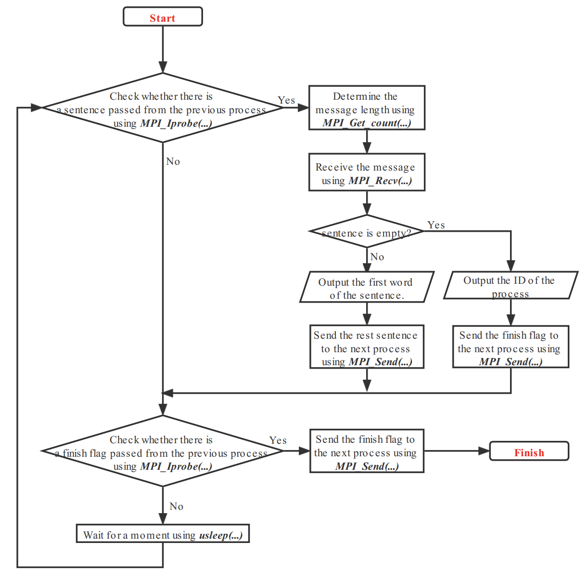

# CS433 Multicore Architecture and Parallel Programming - Assignment on OpenMPI Programming

Hongjie Fang, 518030910150, [galaxies@sjtu.edu.cn](mailto:galaxies@sjtu.edu.cn)

## Environment Setup

Experiment environment is:

- macOS Big Sur 11.5
- 2 GHz Quad-Core Intel Core i5
- 16 GB 3733MHz LPDDR4X

**Note.** Since `makefile` is written under macOS, which has a different compile option with other OS when compiling with OpenMP, we only guarantee that `makefile` can work under the previous system settings (macOS Big Sur 11.5).

## Round-trip Time Test

**Problem Statement**. A MPI task 0 is sending beacon packets to another MPI task 1. After receiving each beacon, task 1 will reply with an ACK. Task 0 could calculate the round trip time of the connection. Please simulate this process using MPI.

**Solution**. The core of my implementation is shown as follows. Here we take round-trip test of `int` type as the example.

```cpp
if (my_rank == 0) {
    // Processor 0
    // Test the round-trip time of int.
    duration = 0;
    for (int i = 1; i <= ntimes; ++ i) {
        gettimeofday(&start, 0);
        MPI_Send(&send_int, 1, MPI_INT, 1, 0, MPI_COMM_WORLD);
        MPI_Recv(&recv_ACK, 1, MPI_CXX_BOOL, 1, 1, MPI_COMM_WORLD, MPI_STATUS_IGNORE);
        gettimeofday(&end, 0);
        // Value check.
        if (! recv_ACK) {
            cout << "[Error] Communication error on int-type value!\n";
        }
        duration += (end.tv_sec - start.tv_sec) * 1e6 + (end.tv_usec - start.tv_usec);
    }
    duration /= ntimes;
    cout << "Round-trip time on int: " << duration << " us.\n";
} else if (my_rank == 1) {
    // Processor 1
    // Test the round-trip time of int.
    for (int i = 1; i <= ntimes; ++ i) {
        MPI_Recv(&recv_int, 1, MPI_INT, 0, 0, MPI_COMM_WORLD, MPI_STATUS_IGNORE);
        // Value check.
        if (recv_int != 1024) {
            cout << "[Error] Communication error on int-type value!\n";
        }
        MPI_Send(&ACK, 1, MPI_CXX_BOOL, 0, 1, MPI_COMM_WORLD);
    }
```

Besides `int` type, we also test `long long`, `double`, `bool` and `char` type. We notice that OpenMPI is not very stable at the beginning of the program, resulting in some abnormal performances (execution times). Therefore, we execute an initialization loop before testing to make the testing process more stable. For each type, we test the round-trip time for 1,000,000 times, and take the average time as the round-trip time of that type. Here are the experiment results.

| Type | Execution Time (us) |
| --- | --- | 
| int | 0.380844 |
| long long | 0.389223 |
| double | 0.383667 |
| bool | 0.386718 |
| char | 0.380946 |

From the experiment results we can see that the round-trip time of every type of data is almost the same (around 0.38 us).

**User manual**. Use the following command to compile, execute and clean, respectively.

```bash
# compile
make
# run
mpiexec -n 2 ./round-trip
# clean
make clean
```

## Pass-String Problem

**Problem Statement**. Consider some children playing a voice passing game. The child #0 say a sentence to child #1, who will write down the first word and pass remaining words to child #2. Child #2 do the same thing as child #1, write down the first word (which is the second word of the original sentence) and pass the remaining words to next child... The first child with no word received write down his ID. Please simulate this process using MPI. (The WRITE DOWN action is substituted by PRINT TO STDOUT).

**Solution.** The flowchart of my implementation is shown as follows. Specially, for process 0, first receive the input, and then execute the steps in the flowchart.



The core of my implementation is shown as follows.

```cpp
string passage; // the initial passage / sentence.
char *psg; // the passage stored in character array.
int length; // the length of the passage.

if (my_rank == 0) {
    // Process 0: (child 0) generate the passage and pass the passage to the 1st child.
    /*
    If define AUTO_EXAMPLE (L43), the source code will generate a default passage;
    otherwise, you may enter the passage yourselves.
    */
    # define AUTO_EXAMPLE
    # ifdef AUTO_EXAMPLE
    passage = "Mary has a little lamb, little lamb, little lamb.";
    # else
    getline(cin, passage);
    # endif
    
    length = passage.size();
    psg = new char[length];
    for (int i = 0; i < length; ++ i) 
        psg[i] = passage[i];
    
    cout << "Process " << my_rank << ": The original sentence is \"" << passage << "\".\n";

    // Pass (send) the passage to the 1st process (child) with tag 0.
    MPI_Send(psg, length, MPI_CHAR, 1, 0, MPI_COMM_WORLD);

    // De-allocate the spaces.
    delete [] psg;
}

// Process k: (child k) receive the passage from the previous child, write down the first word and pass the remaining words to next child.
bool finish; // finish signal
int flag = 0, flag_finish = 0; // flag of receiving string; flag of receiving finish signal
MPI_Status status; // message status
int last_id = (my_rank == 0 ? comm_sz - 1 : my_rank - 1); // the last child
int next_id = (my_rank == comm_sz - 1 ? 0 : my_rank + 1); // the next child  

// Check the message repeatedly.
while (true) {
    // If get the message with tag 0 from the previous process (child).
    MPI_Iprobe(last_id, 0, MPI_COMM_WORLD, &flag, &status);

    if (flag == 1) {
        // Get the length of the message.
        MPI_Get_count(&status, MPI_CHAR, &length);

        if(length == 0) {
            // Empty message means that the passage is over. Then the first child with no word received write down his ID.
            MPI_Recv(NULL, 0, MPI_CHAR, last_id, 0, MPI_COMM_WORLD, MPI_STATUS_IGNORE);
            finish = true;
            cout << "Process " << my_rank << ": " << my_rank << endl;

            // Pass the finish message to the following child with tag 1.
            MPI_Send(&finish, 1, MPI_CXX_BOOL, next_id, 1, MPI_COMM_WORLD);
        } else {
            // Allocate spaces for message.
            psg = new char[length];

            // Receive the message from the previous process (child).
            MPI_Recv(psg, length, MPI_CHAR, last_id, 0, MPI_COMM_WORLD, MPI_STATUS_IGNORE);
            
            // Get the next word.
            int nxt = 0;
            while(nxt < length && psg[nxt] != ' ' && psg[nxt] != '\t' && psg[nxt] != '\n') ++ nxt;

            // Print the word in the screen.
            cout << "Process " << my_rank << ": ";
            for (int i = 0; i < nxt; ++ i) cout << psg[i];
            cout << endl;

            // Eliminate duplicate spaces, tab and blank lines.
            while(nxt < length && (psg[nxt] == ' ' || psg[nxt] == '\t' || psg[nxt] == '\n')) ++ nxt;

            // Pass (send) the rest passage to the next process (child) with tag 0.
            MPI_Send(psg + nxt, length - nxt, MPI_CHAR, next_id, 0, MPI_COMM_WORLD);
            
            // De-allocate the spaces.
            delete [] psg;
        }
    }
    // If get the message with tag 1 from the previous process (child), that means the string passing is finished.
    MPI_Iprobe(last_id, 1, MPI_COMM_WORLD, &flag_finish, &status);

    // Pass the finish message to the following process.
    if (flag_finish == 1) {
        // Receive the message from the previous process (child).
        MPI_Recv(&finish, 1, MPI_CXX_BOOL, last_id, 1, MPI_COMM_WORLD, MPI_STATUS_IGNORE);

        // Value check.
        if (! finish) cout << "[Error] Unexpected error occured!\n";

        // Pass (send) the finish message to the next process (child) with tag 1.
        MPI_Send(&finish, 1, MPI_CXX_BOOL, next_id, 1, MPI_COMM_WORLD);
        break;
    }

    // Wait for some time.
    usleep(SLEEP_DURATION);
}
```

We use sentence "Mary has a little lamb, little lamb, little lamb." as an example. From the example we can see that the program outputs:

```text
Process 0: The original sentence is "Mary has a little lamb, little lamb, little lamb.".
Process 1: Mary
Process 2: has
Process 3: a
Process 0: little
Process 1: lamb,
Process 2: little
Process 3: lamb,
Process 0: little
Process 1: lamb.
Process 2: 2
```

From the results we can verify the correctness of our program. After several passing, process 2 receive an empty string, therefore it outputs its ID. The rest process does not need to output.

**User manual**. Use the following command to compile, execute and clean, respectively.

```bash
# compile
make
# run
mpiexec -n 4 ./pass-string
# clean
make clean
```
